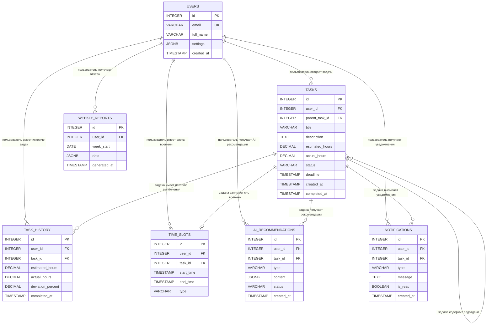

```mermaid
erDiagram
    USERS {
        INTEGER id PK
        VARCHAR email UK
        VARCHAR full_name
        JSONB settings
        TIMESTAMP created_at
    }

    TASKS {
        INTEGER id PK
        INTEGER user_id FK
        INTEGER parent_task_id FK
        VARCHAR title
        TEXT description
        DECIMAL estimated_hours
        DECIMAL actual_hours
        VARCHAR status
        TIMESTAMP deadline
        TIMESTAMP created_at
        TIMESTAMP completed_at
    }

    TASK_HISTORY {
        INTEGER id PK
        INTEGER user_id FK
        INTEGER task_id FK
        DECIMAL estimated_hours
        DECIMAL actual_hours
        DECIMAL deviation_percent
        TIMESTAMP completed_at
    }

    TIME_SLOTS {
        INTEGER id PK
        INTEGER user_id FK
        INTEGER task_id FK
        TIMESTAMP start_time
        TIMESTAMP end_time
        VARCHAR type
    }

    AI_RECOMMENDATIONS {
        INTEGER id PK
        INTEGER user_id FK
        INTEGER task_id FK
        VARCHAR type
        JSONB content
        VARCHAR status
        TIMESTAMP created_at
    }

    NOTIFICATIONS {
        INTEGER id PK
        INTEGER user_id FK
        INTEGER task_id FK
        VARCHAR type
        TEXT message
        BOOLEAN is_read
        TIMESTAMP created_at
    }

    WEEKLY_REPORTS {
        INTEGER id PK
        INTEGER user_id FK
        DATE week_start
        JSONB data
        TIMESTAMP generated_at
    }

    USERS ||--o{ TASKS : "пользователь создаёт задачи"
    USERS ||--o{ TASK_HISTORY : "пользователь имеет историю задач"
    USERS ||--o{ TIME_SLOTS : "пользователь имеет слоты времени"
    USERS ||--o{ AI_RECOMMENDATIONS : "пользователь получает AI-рекомендации"
    USERS ||--o{ NOTIFICATIONS : "пользователь получает уведомления"
    USERS ||--o{ WEEKLY_REPORTS : "пользователь получает отчёты"

    TASKS ||--o{ TASKS : "задача содержит подзадачи"
    TASKS ||--o| TIME_SLOTS : "задача занимает слот времени"
    TASKS ||--o{ TASK_HISTORY : "задача имеет историю выполнения"
    TASKS ||--o{ AI_RECOMMENDATIONS : "задача получает рекомендации"
    TASKS ||--o{ NOTIFICATIONS : "задача вызывает уведомления"
```
